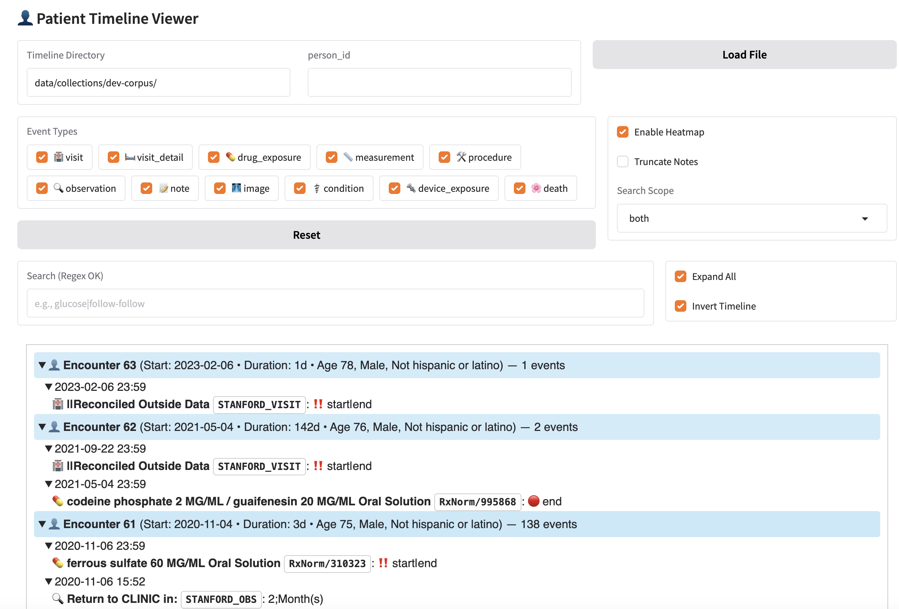

# MEDS-to-Text (`meds2text`)
Transform MEDS-formatted data into text representations from OMOP CDM sources.

> [!WARNING]
> Currently `meds2text` assumes the MEDS extract is sourced from OMOP CDM sources.
> This repo is not optimized for effeciency and was built for research expediency 🤪.

### Projects Using `meds2text`

- [Medalign: A clinician-generated dataset for instruction following with electronic medical records](https://ojs.aaai.org/index.php/AAAI/article/view/30205) (AAAI 2024)
- [TIMER: Temporal Instruction Modeling and Evaluation for Longitudinal Clinical Records](https://arxiv.org/abs/2503.04176) (2025)


### Development Roadmap
- [x] Initial refactor
- [ ] Remove hard-coded OMOP/Stanford MEDS assumptions
- [ ] Refactor for modular subclassing of new formatters
- [ ] Implement yaml configuration files 
- [ ] Implement rule-based FHIR formatter using [fhir.resources](https://github.com/nazrulworld/fhir.resources)
- [ ] Implement model-based event decoder 


## 🚀 Installation

For development (from source):

```bash
git clone https://github.com/VISTA-Stanford/meds2text
cd meds2text
pip install -e .[dev]
```

## 📦 Data Dependencies

- **Athena Vocabularies**: Required for OMOP concept mapping. See section "Athena Vocabularies" for guidance on where to download or build from scratch.
- **Metadata (OPTIONAL)**: Events can be linked to `care_site_id`, `provider_id`, and `payer_plan` via external dataframes if not present in the MEDS extract.
- **MEDS Extract**: Can be generated using internal STARR OMOP CDM data or via existing public extracts.
  - [MedAlign](https://stanford.redivis.com/datasets/48nr-frxd97exb)
  - [INSPECT](https://stanford.redivis.com/datasets/dzc6-9jyt6gapt)
  - [EHRSHOT](https://stanford.redivis.com/datasets/53gc-8rhx41kgt)
  - MIMIC-IV (see here and here) 	

## ⚡ Quick Start: Textifying a MEDS Extract

Convert INSPECT (or any MEDS dataset) to LUMIA XML markup. This should take ~10 minutes for 19,391 patients using 8 CPU cores.

### Default: Export All Structured Data + Notes

```bash
python src/meds2text/textify.py \
--path_to_meds data/meds_extracts/meds_reader_omop_inspect/ \
--path_to_ontology data/athena_omop_ontologies/ \
--path_to_metadata data/omop_metadata/ \
--path_to_output data/inspect_lumia_xml/ \
--exclude_props clarity_table \
--format lumia_xml \
--include_contexts person providers care_sites \
--apply_transforms \
--event_types "*" \
--n_processes 8 
```

### Options: Format

- LUMIA XML \[default\]  (see [specification](docs/markup.md))  
- JSONL 
- FHIR-like [sketch-only]

### Options: Filter Properties

Events have a number of properties defined by the source ETL. Some properties are useful for materializing a graph view of event provenance, e.g., `clarity_table`, `provider_id`, `visit_id`, `care_site_id`. Other properties make sense for OMOP CDM sourced data, which provides standardzied event `type` properties. 

To miminize markup bloat, you can filter out events using `--exclude_props`.

### Options: Filter Events

Generate markup for **notes + visits** and exclude providers + care_sites

```bash
python src/meds2text/textify.py \
--path_to_meds data/meds_extracts/meds_reader_omop_inspect/ \
--path_to_ontology data/athena_omop_ontologies/ \
--path_to_metadata data/omop_metadata/ \
--path_to_output data/inspect_lumia_xml/ \
--exclude_props clarity_table visit_id provider_id \
--format lumia_xml \
--include_contexts person \
--apply_transforms \
--event_types note visit_detail visit \
--n_processes 8
```

Generate markup for **only structured data** and exclude providers + care_sites


```bash
python src/meds2text/textify.py \
--path_to_meds data/meds_extracts/meds_reader_omop_inspect/ \
--path_to_ontology data/athena_omop_ontologies/ \
--path_to_metadata data/omop_metadata/ \
--path_to_output data/inspect_lumia_xml/ \
--exclude_props clarity_table visit_id provider_id \
--format lumia_xml \
--include_contexts person \
--apply_transforms \
--event_types condition death device_exposure drug_exposure image measurement observation procedure visit visit_detail \
--n_processes 8
```

## 📊 Timeline Viewer

After generating LUMIA XML files, you can use the interactive timeline viewer to visualize patient timelines in a web interface.



### Features

- **Interactive Timeline Visualization**: Browse patient encounters chronologically with collapsible sections
- **Event Filtering**: Show/hide specific event types (visits, medications, procedures, notes, etc.)
- **Search & Highlight**: Search across event names and values with regex support
- **Heatmap View**: Color-code encounters based on event density
- **Customizable Display**: Toggle note truncation, expand all sections, and invert timeline order

### Usage

Launch the timeline viewer with a directory containing XML files:

```bash
python apps/timeline_viewer/app.py \
--timeline_dir data/inspect_lumia_xml/ \
--person_id 125614144
```

**Parameters:**
- `--timeline_dir`: Directory containing LUMIA XML timeline files
- `--person_id`: Unique substring of XML filename to load on startup (optional)

The viewer will launch a web interface where you can:
1. Select different patients by entering a person ID
2. Filter event types using checkboxes
3. Search for specific terms or patterns
4. Customize the display options

## 🛠️ Detailed Reproduction Steps

For mapping codes to text strings, we rely on medical vocabularies and ontologies. For MEDS extracted souced from OMOP CDM datasets, we can use a pre-packed collection of vocabularies.

### 1. Athena Vocabularies

#### ☁️ Option A. Download Prebuilt Dependencies from GCS

If you have access to the Stanford VISTA project, you can download all dependencies from:

```bash
gsutil -m cp -r gs://su-vista/shah_lab/meds2text/data ./data
```

#### 🏗️ Option B. Create from Scratch

- Register and download the vocabularies from [OHDSI Athena](https://athena.ohdsi.org/vocabulary/list).
- Generate an API KEY for your [UMLS account profile](https://uts.nlm.nih.gov/uts.html#profile) and use `cpt.sh` to download the CPT4 vocabulary and auto-update Athena vocabularies
- Place the resulting folder (or zip file) in your `data/` directory (e.g., `data/athena_ontologies_snapshot/`).

Run the following script to initialize the parquet and trie files for fast ontology lookup.

```bash
python scripts/init_athena_ontologies.py \
--athena_path data/athena_ontologies_snapshot.zip \
--custom_mappings data/stanford_custom_concepts.csv.gz \
--save_parquet data/athena_omop_ontologies
```

### 2. MEDS Extracts

See [here](https://github.com/VISTA-Stanford/ehr-tumorboard?tab=readme-ov-file#examples) for working instructions on generating STARR MEDS extracts.

## 📄 License

Apache 2.0 License. See [LICENSE](LICENSE) for details.


